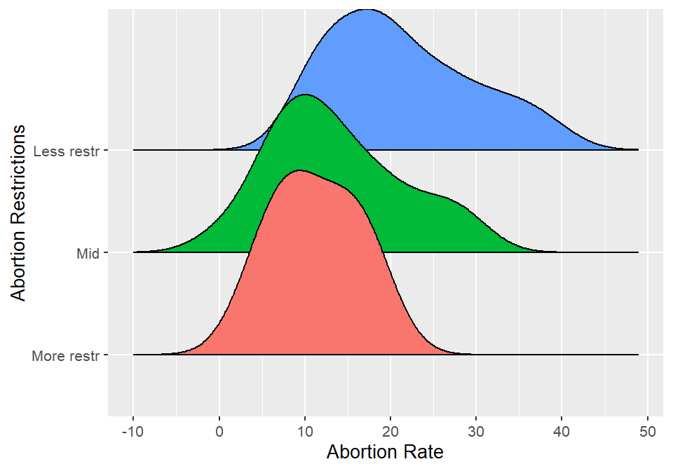
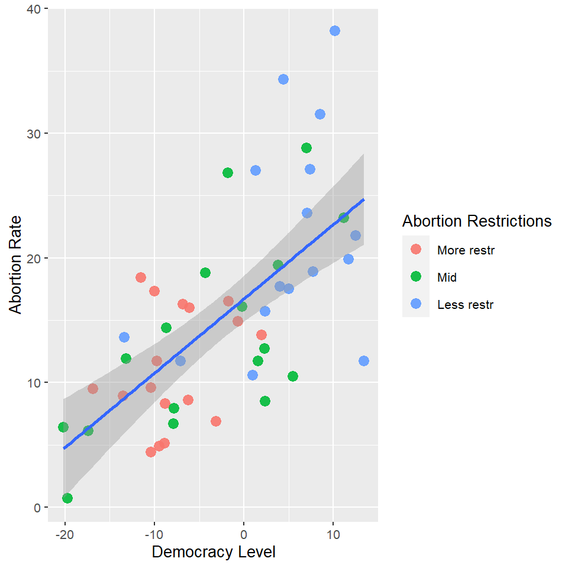
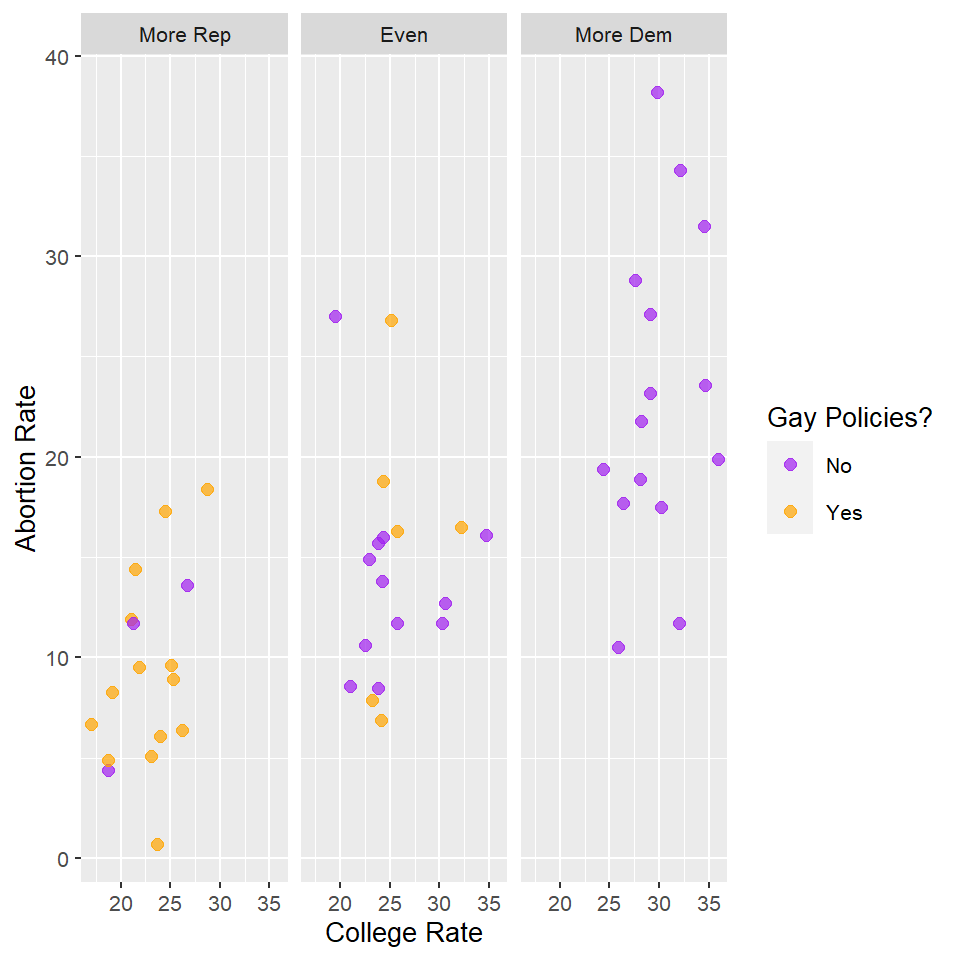
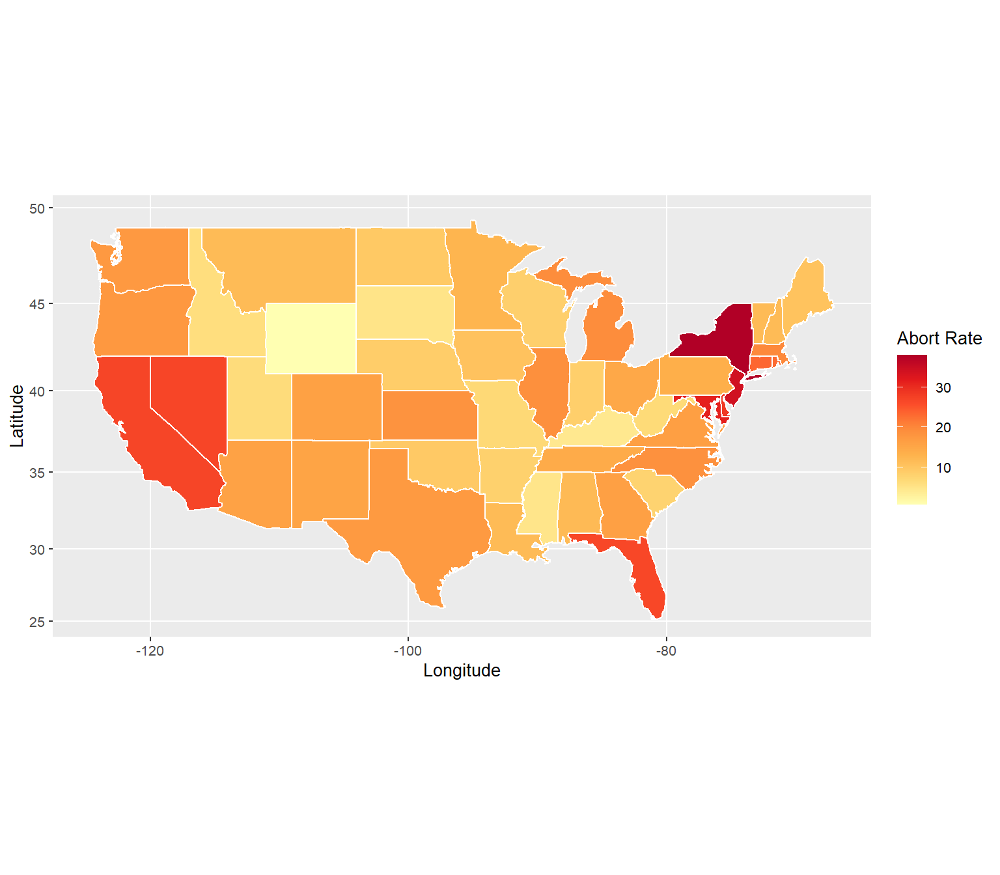

# Introduction

For the concluding Data Visualization course project, I will analyze United States abortion rates and their relationships with different social, economic, and political variables. In addition, I will attempt to visualize a possible relationship between the geographic location of each state and its abortion rates, I intend to attempt that by producing a choropleth (mapping to fill colors). I believe that this type of analysis is relevant because it deals with important topics of the world, and because the United States is a big multi-cultural country, I believe that we may be able to consider it a small sample of the rest of the world.    

The data set I will be using is called "states" and it was extracted from the R package "poliscidata". This data set is used to demonstrate the application of R to political analysis.

The data set includes 50 observations (one for each state), and 135 variables. I opted to rename some of the variables to ease future coding understanding, and I summarized the data into a new so-called "States" data set. Information about the full data set can be found at  https://cran.r-project.org/web/packages/poliscidata/poliscidata.pdf.
In the table below, you can observe all the variables that I may use in future visualizations (notice that the names included are adapted for better understanding). 

Name                        Type             Description
----------------------     -------         -------------------------------------------------
State                      Factor          State name
State ID                   Factor          Two letter postal abbreviation for state name
Abortion Restrictions      Factor          Abortion restrictions (Three category ranking)
Abortion Rates             Numeric         Abortions per 1,000 women (2005)
Abortion Laws              Integer         Number of restrictions on abortion (2010)
College                    Numeric         Percent of population with college or higher
Democracy Score            Numeric         Cook Index: Higher scores mean more Democratic
Democracy Level            Factor          Three quantiles of cook_index
Gay Policy?                Factor          Does state have ’most conservative’ gay policies?

# Analysis

As we should all know by now, abortion is a very delicate topic for many different reasons; this project aims the visualization of possible patterns and relationships within the variables in the data set. It does not express the author's opinion, and it is not attempting to influence the readers' view of the topic. 

## Abortion Rates and Restrictions

Before jumping into comparing the possible correlations of different socioeconomic variables  with abortion in the United States, I will start by checking how the level of abortion restriction is affecting the number of abortions in the United States. Differently from most of the countries in the globe, the United States' states have the autonomy to create regional laws, which means that each state deals with abortion with a different approach. 

Figure 1 shows a density representation of the abortion rate in each state for each of the three levels of restriction (less restrictive, more restrictive, and on in between both). Here we can clearly see the difference between each of the levels of restriction, where more restrictive states have, in general, lower abortion rates and the opposite for the least restrictive. Although expected, this is a good way to start understanding our data; if we could exclude thousands of other variables, we could conclude that more restrictive policies are being somewhat successful in their objective of reducing abortion numbers.   

Density plot of abortion restrictions and abortion rate.

## Abortion Rates and Democracy Level

For our next visualization, I will check if the abortion rates and restriction levels could be correlated to the politics of each state by adding the democracy variable into our plot. 

This time I opted for a scatter plot, that clearly shows that as the democracy levels increase from each state, the abortion rate is also increasing. So the chances of having higher rates are higher in states where they rule by a more democratic view. In addition, we can also see, by the point's color, that the states with greater legal restrictions over abortion are, in general, the ones that have the least democracy scores. A linear regression line is included to support the trend visualization.  

The relationship between abortion rates, level of abortion restrictions and democracy levels. A linear regression line and its standard error was included to support the pattern visualization.

## Education, Gay Policies, Political Orientation, and Abortion  

Exactly, I am going to include all that in one visualization. This time I will facet the plot by three political options (Majority Republican, Even, Majority Democrat) and the colors are describing if state laws prohibit same-sex relationships.

The result is our Figure 3. It is interesting to observe the color distributions, as none of the states with majority democrats interfere in homosexual relationships. In addition to that, we can see a higher percent of the state's population with college degrees in the "More Dem" part of the graph, together with higher abortion rates. It is hard to determine which affects which, but the graph clearly shows a positive relationship between democratic inclination, college levels, abortion rate, and the presence of gay policies in each state. 

Faceted scatterplot including political inclination, abortion rate, college rate and the presence of gay policies in each state. Opacity was slightly changed (alpha = 0.7) to deal with the few overlaping points.

## Mapping the Abortion Rates Throughout the United States Territory 

Finally, as promised in the introduction, an attempt to visualize a possible relationship between the geographic location of each state and its abortion rates. Figure 4 includes the abort rate for each state in form of color, in which higher abortion rates are represented by the darkest colors. As we can see, abortion rates are not related to geographic locations. Furthermore, we can clearly see the New York and Wyoming have the highest and lowest rates, respectively. 

I chose to use the "YlorRd" color palette from the brewer sequential palettes, which includes sequential, diverging, and qualitative palettes, many tailored to individuals with color blindness. 

United States abortion rates per state visualized in a choropleth. This map was created to be viewed with colors. Color pallete ('YlOrRd') was chosen taking color blind readers into consideration.

 

 
\newpage

 
# Conclusion

Because this analysis was not capable of including all the variables affecting the abortion rates in the United States, it is impossible to confirm the causation of each of the presented variables. However, as you could see, there are variables that seemed to be correlated to the main topic, such as democracy levels and college rates for each state. I found it very interesting to see the political divisions related to the presence of gay policies, and also how the level of education is somewhat correlated with the political views in each state. As stated in the introduction of the project, the United States is a big multi-cultural country, so I believe that some of the correlations that were observed above could possibly be replicated to other countries. For instance, one could think that countries that are more educated tend to be more democratic. 

